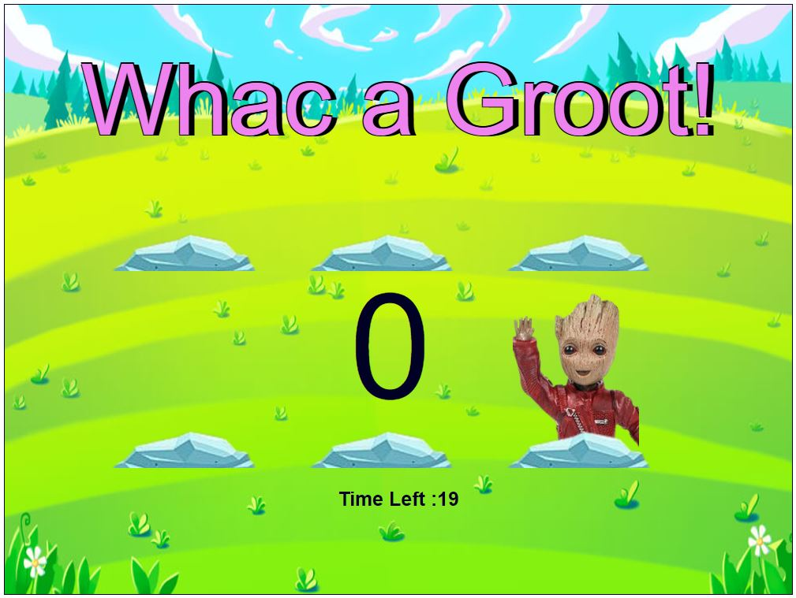

# Whac a Groot
Whac-a-Groot is Grid-based game based on whac-a-mole concept built in vanilla JavaScript, HTML and CSS

The idea is simple! The player needs to hit the grid with the mole in as many times as possible until the time runs out.

### Reference
[Franks Laboratory](https://www.youtube.com/watch?v=RTb8icFiSfk) 
